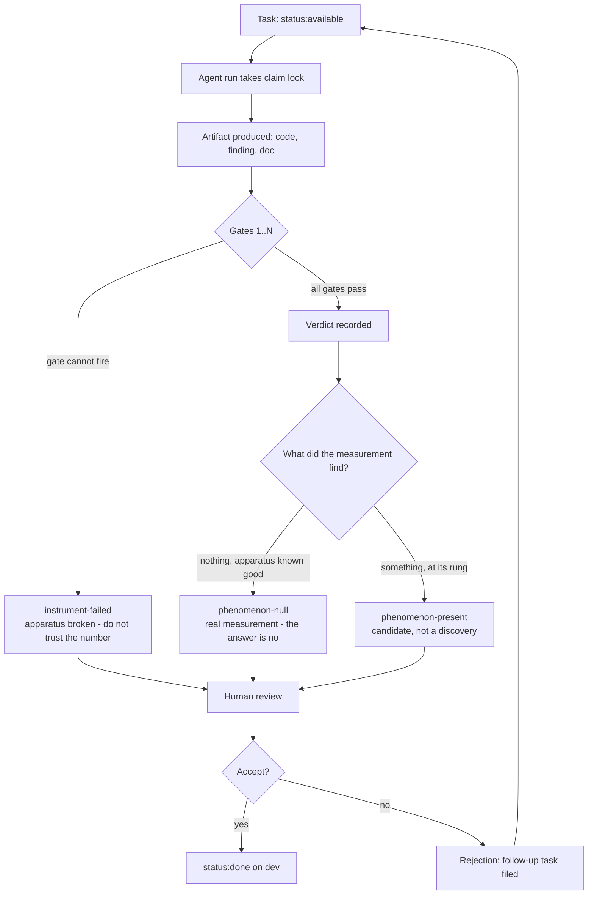

# Ephapse

> **Proof-of-concept stage.** No co-activation event has been found and
> reviewed by a human yet. The scaffolding is deliberately minimal — see
> "What not to build yet" below.
>
> What *has* landed, as of 2026-09-19: the detector is validated against an
> injected positive control (DEC-017/018/024), the target model is settled at
> `pythia-70m-deduped` (DEC-014), the validation layer is adopted (DEC-021),
> and a first probe found a **weak but non-trivial** verbal↔symbolic
> bridging signal (6 survivors vs 0 under a shuffled null). The general
> cross-domain probe then ran and returned a **clean null**: the positive
> control recovers, the two input sets share zero tokenizer ids, and no
> feature co-activates across them above the family-wise cutoff (DEC-027).
> Single-feature causal intervention is site- and scale-dependent — real on
> the logit scale at a feature's own token, invisible on a probability scale
> at the output (DEC-020/DEC-025), so rung-3 causal claims are not currently
> reachable. See `findings.jsonl` and `experiments/README.md` for the run log.

Ephapse probes open-weight model internals — activations, sparse-autoencoder
features, circuits — to find **cross-domain co-activation**: cases where
unrelated inputs trigger the same internal structure. The bet is that such
overlaps are a useful *candidate generator* for mathematical hypotheses.

Named for the neuroscience term for unintended signal crossover between
adjacent neurons (as opposed to a *synapse*, the intended connection). That
crossover is the literal phenomenon being searched for, here in a network's
activation space instead of a brain.

## At a glance

- **Substrate:** open-weight model weights and activations (not Lean terms).
- **Toolchain:** Python / PyTorch — TransformerLens, SAELens, Neuronpedia.
- **Validation story:** statistical and exploratory. **There is no kernel
  oracle here** — that is the central difference from Maith — so a two-tier
  automated validation layer (`tooling/gates/`, DEC-021) carries as much of
  the discipline as is mechanically checkable.
- **Single active branch:** `dev`.
- **Status:** proof-of-concept, and the first real output is a **methodology
  null-result assessment**. The detector is validated; a probe returned a
  weak bridging signal; the general cross-domain probe returned a clean null
  at 70M (see the status note above). No co-activation event has been
  human-reviewed, and no mathematical claim has been handed to Maith.

## What this project produces

Two outputs, and the second is not scaffolding for the first. Stated plainly
because the repo has under-claimed it (DEC-034).

1. **The candidate generator.** Cross-domain co-activation as a source of
   candidate mathematical hypotheses. This is the *scientific* goal. It has
   returned a clean null at 70M so far (`docs/ROADMAP.md` rungs 0–2), and the
   live question is whether that null survives at larger scale (rung 3).
2. **The validation layer.** A two-tier, fixture-gated method for telling
   **instrument failure** from **phenomenon absence** —
   `instrument-validated` / `instrument-failed` / `phenomenon-null` /
   `phenomenon-present` — plus the discipline that makes it enforceable: every
   check ships a fixture that makes it fail, and a check that cannot fail is not
   a check. Authority: `docs/reference/TEST_VALIDATION_SPEC.md`; the
   `instrument-*` / `phenomenon-*` vocabulary is defined in
   `docs/reference/PROGRAM_MANAGEMENT_SPEC.md` §3.2.

**Why (2) is a first-class output and not a prerequisite.** The vocabulary is
rare in practice and was expensive here: five measurements in this repo produced
plausible-looking results that were artifacts of vacuous code, and a single null
had to be adjudicated across three decision entries to establish whether it was
an instrument failure or an absent phenomenon (DEC-019, DEC-020, DEC-023,
DEC-024). A method whose nulls carry a *demonstrated* sensitivity floor is
usable by anyone probing small models, independently of whether (1) ever
succeeds.

**What this does not change.** Repositioning an existing asset is not building
new infrastructure. This is a statement about what the work *is*, not a licence
to build more: "What not to build yet" below is unchanged, and no new validation
machinery is proposed by this framing. The layer's 38 specified gates and their
fixtures already exist; the change is that they are described as an output rather
than as scaffolding.

## How a task moves through the pipeline

The lifecycle in one picture. It is the same for every task: a run takes the
claim lock, produces an artifact, and the artifact must survive the validation
layer before a human sees it. The two failure branches are not edge cases —
distinguishing them is the whole point of the layer.



Read the two middle branches together. `instrument-failed` and
`phenomenon-null` both read "no significant result" in a log and mean opposite
things: the first says the pipeline is broken and the number should not be
trusted, the second says the pipeline works and the answer is genuinely no. A
vocabulary that cannot tell them apart at a glance will keep costing the
rediscovery — which is what DEC-023 and DEC-024 record
(`docs/reference/PROGRAM_MANAGEMENT_SPEC.md` §3.2).

## What this project is not

- **Not a fork or extension of Maith.** Different substrate, different
  toolchain, different validation story.
- **Not a training project.** No model is trained or fine-tuned here. Every
  model is pretrained, open-weight, and used read-only for probing.
- **Not a P vs NP project**, and not a circuit-complexity project
  specifically. Domain-general cross-domain search, on the same reasoning
  as Maith's non-goals: aiming narrowly at a famous target produces worse
  scoping than aiming at a falsifiable, general method.
- **Not authorized to claim a discovery is novel or valid** on the strength
  of anything computed here.

## What counts as a result

A flagged co-activation event is a **statistical observation**, not a
finding. Significance is the bar for "worth a human looking at it," not
"worth calling a discovery." Writeups read like lab notebook entries, not
announcements. A candidate becomes a claim only by surviving Maith's gates.

**Unusual activation is not evidence of correctness.** Hallucination-like
generation and genuine insight can look identical from inside activation
statistics alone.

## Relationship to Maith

One-way handoff at exactly one interface point:

1. Ephapse flags a cross-domain co-activation event.
2. **A human** reviews it and, if worth pursuing, articulates it as a
   plain-language mathematical claim.
3. That claim goes to Maith as an ordinary candidate proposal, entering
   Maith's existing gate 1 (homomorphism obligation) like any other.

Ephapse does not implement Maith's gates 2–5, and no Lean validation layer
is built here. If a candidate needs Lean checking, it goes to Maith.

## Two model roles (and a third path)

Frequently conflated; see `docs/AGENT_HANDOFF.md` for the full statement.

1. **The agent-driving LLM** — writes code, drives the agent loop, API-only.
   **It cannot be probed.** No role in the research subject.
2. **The probed model** — a small open-weight model, downloaded from
   HuggingFace and loaded locally in-process. The only kind of model
   TransformerLens/SAELens can instrument. Note the choice is constrained by
   **SAE availability, not size**: SAELens ships Pythia SAEs only for
   `pythia-70m-deduped` (no 160M release), so that is the settled target
   (DEC-014).
3. **The remote probing API** (Neuronpedia; nnsight/NDIF for larger models)
   — a *third path*, not a smaller local one. Returns dashboards and top-k
   activations, never an arbitrary activation matrix — and **not** decoder
   vectors: `hasVector` is false and `vector` is empty, so the decoder
   direction comes from local `sae.W_dec` (DEC-015). Its binding constraint
   is rate limit, not sandbox RAM.

## Compute

Measured, not estimated — see `docs/reference/SANDBOX_BASELINE.md`.

| Resource | Measured |
|---|---|
| RAM | 15 GiB total, ~13 GiB available (CPU only, no GPU); budget ~10 GB per run — no cgroup cap is enforced |
| CPU | 4 cores |
| Disk | 58 GB free on `/` |
| Pythia-160M | 2.68 GB RSS; 207 ms single-prompt, **21 ms/prompt at batch 64** |
| Pythia-70M | 1.52 GB RSS |

The old "Pythia-160M / ~217 ms per pass" row described a model that has no
usable SAE release (DEC-014) and a latency figure that conflated per-call
overhead with batched throughput. Size **sweeps** on the batched number
(2,000 prompts ≈ 40 s) and **interactive iteration** on the single-prompt
number. This caps interactive CPU probing at roughly 70M–1B parameters;
larger models technically run but latency makes iteration impractical.
TransformerLens loads fp32 by default, so dtype and cached activations — not
parameter count alone — are the real constraint.

## Tooling

Neuronpedia (hosted SAE features) · TransformerLens (probing) · SAELens
(pretrained SAEs) · Pythia suite (interpretability-native models) ·
nnsight/NDIF (remote GPU for larger models).

Prefer targets with real SAE coverage — GPT-2-small and the Pythia suite
have the deepest coverage — over picking a size and hoping an SAE exists.

## Layout

```
README.md                    — this file
requirements.txt             — pinned deps (CPU torch build)
experiments/                 — one dated file per experiment, with a header
                               stating model, inputs, and what's tested;
                               run log in experiments/README.md
findings.jsonl               — append-only log of co-activation events,
                               positives and nulls alike. Observations only;
                               no conclusions.
docs/AGENT_HANDOFF.md        — scope, non-goals, constraints, first issues
docs/MULTI_AGENT_WORKFLOW.md — claiming, run-ids, dependencies, done-evidence
docs/reference/SANDBOX_BASELINE.md — measured sandbox numbers + evidence
docs/reference/PRIOR_ART.md  — literature review; read before designing a probe
docs/reference/TEST_VALIDATION_SPEC.md — the adopted two-tier validation layer
docs/reference/PROGRAM_MANAGEMENT_SPEC.md — the adopted program-tracking layer
docs/reference/EPHAPSE_SPECIFICATION_ASSESSMENT.md — review of the external spec
docs/ROADMAP.md              — the verdict-revision rung ladder (where the
                               method stands, and what would revise the null)
docs/decisions/LOG.md        — decision log (DEC-001 onward)
tooling/gates/               — Tier-0 integrity gates (fixture-gated) + runner
tooling/program/             — atomic issue-state setter + cache refresh
tooling/claims/              — claim lock (git-ref CAS) + collision audit
```

## Where the method stands

The claim-level ladder is in `TEST_VALIDATION_SPEC.md` §5; the **project-level**
ladder is `docs/ROADMAP.md`, adopted in DEC-033. It is a *verdict-revision*
ladder rather than PleaNP's construction ladder, because the method has already
returned a verdict: rungs 0–2 are done (validated, surface-controlled, clean
null), rung 3 (sensitivity at scale) is the single live rung and is **feasible**
(`gemma-2-2b` has 316 SAEs), rung 4 depends on it, rung 5 is an explicitly
human step with no falsifier, and rung 6 is the Maith handoff.

**Foreclosed at every rung, so it is not re-argued:** this project does not
certify novelty and does not produce commercial assets. An external spec
proposing exactly that was reviewed and rejected (DEC-033,
`EPHAPSE_SPECIFICATION_ASSESSMENT.md`).

## Validation layer (adopted 2026-09-19, DEC-021)

The discipline is not prose-only any more. `docs/reference/TEST_VALIDATION_SPEC.md`
is the adopted authority, implemented by `tooling/gates/`:

- **Tier 0** — no model load, no torch, no network: schema, text, and
  cross-reference checks over `findings.jsonl`, experiment headers, and docs,
  plus the `G-C` experiment-code gates. Runs in CI. **29 of the 38 gates** (per
  the spec's gate inventory; `tooling/gates/gate_inventory.py` derives the
  count mechanically — do not hand-copy it).
- **Tier 1** — requires loading the probed model: the detector-validity gates
  (positive control, control-can-fail, null calibration, constructibility,
  paraphrase survival, causal load-bearing, interference control).

**A tier-0 pass is not a gate pass** — a green run means the artifacts are
internally consistent, not that a detector measures what it claims. Every gate
ships a fixture that makes it fail, and the runner reports `BROKEN` (and fails)
if it cannot demonstrate the gate firing. A gate that cannot fail is not a
check.

Records in `findings.jsonl` sit on a status ladder: rung 0 Observed, rung 1
tier-0-clean, rung 2 paraphrase-surviving, rung 3 causal at *per-feature*
granularity (not currently reachable at `pythia-70m` — DEC-020 measured 0/50,
and DEC-025 found the per-feature effect real only on the logit scale at a
feature's own token, with 3 of 4 features failing context isolation),
rung 4 causal at *aggregate* granularity (the dose-response ladder — the
strongest rung currently attainable). **The word "finding" is reserved for
rung 3 and above.**

## Read this before designing an experiment

`docs/reference/PRIOR_ART.md` is not optional background. It establishes
that SAE feature universality across models is already known, and that SAE
features co-occur more than chance as a baseline — so raw cross-domain
co-activation is close to the expected result rather than a signal. The
interesting object is co-activation that survives a filter built to kill
the boring cases, and the review specifies that filter (NPMI plus semantic
distance, a positive control, clustering for feature splitting, a surprise
criterion).

## What not to build yet

No proposal generator, no promoted-findings database — not before a single
co-activation event has been found and reviewed by a human. Maith built
infrastructure ahead of any result once already and had to justify it
afterward. Don't repeat that here at a smaller scale.

The validation layer (`tooling/gates/`, DEC-021) is **not** an exception to
this: it is process discipline over artifacts that already exist, adopted
deliberately rather than built ahead of a result, and it generates nothing.
"Automated gate-checker" in the sense of a system that promotes candidates or
adjudicates claims remains out of bounds until there is a candidate to check.

## Working on this repo

Read `docs/AGENT_HANDOFF.md` first, then `docs/MULTI_AGENT_WORKFLOW.md` for
the claiming protocol. Development happens on the single `dev` branch.
